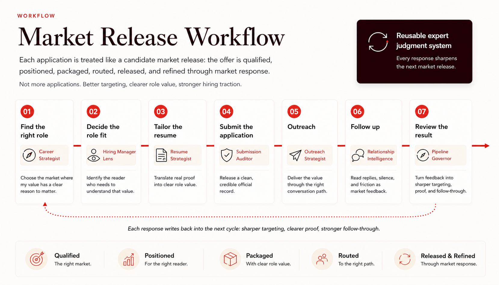
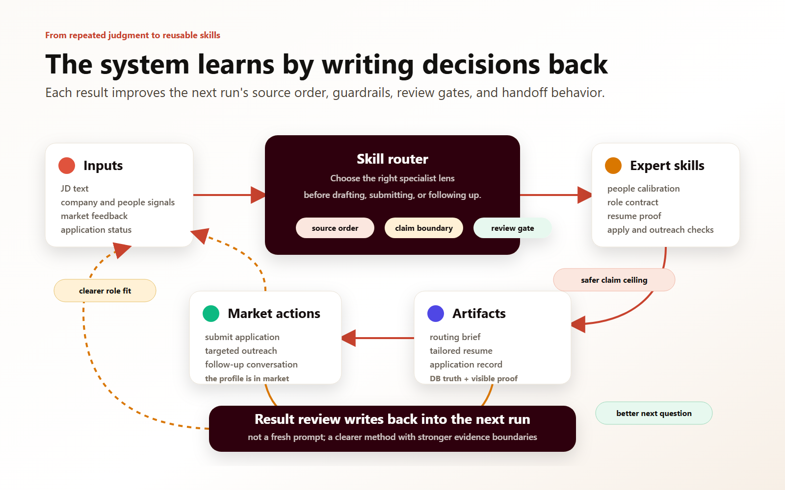
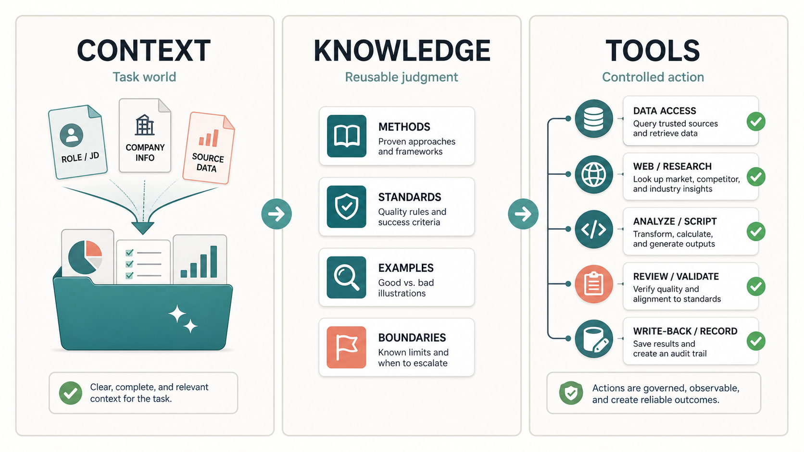
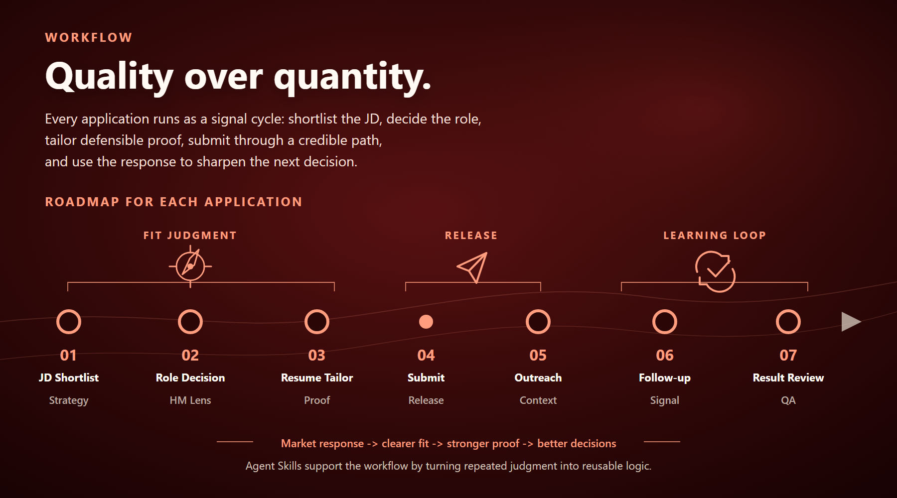

# Governed AI Workflow

> ### You don't scale labor. You scale judgment.

**I turn messy market signals into decisions a team can trust — AI runs the volume, judgment stays human.**

This repository is the proof, opened up: my own job search runs as a governed AI pipeline — dozens of versioned judgment skills screening 20K+ job-market signals under rules I defined and reviewed, where every claim ships with its own boundary. This public repo is a curated case study of that private, running system.

**Don't take the pitch — audit an artifact.** Start with [a routing brief produced by a published skill, run on a fictional job post](examples/routing-brief-sample.md), then check every field against the [skill contract that generated it](skills/jd-loop-routing/SKILL.md).



*The operating picture: each application treated as a market release — qualified, positioned, packaged, routed, released, refined through market response. (This visual shows an earlier seven-card layout; the current system runs six gates — outreach and follow-up merged into one.)*

*The production system runs in Traditional Chinese; the exhibits here are translated adaptations, disclosed per file.*

---

## §1 · The loop

The single mechanism everything else demonstrates:

**Define → Evaluate → Codify → Tighten → Reuse.**

Notice a recurring judgment; run it on real cases with a human making the calls; write the stabilized judgment into a natural-language skill; when a run misses, fix the *rule*, not just the output; start the next run from the tightened rule. Judgment written this way compounds — judgment kept in your head just repeats.



Full walk-through with a real iteration: [docs/the-loop.md](docs/the-loop.md)

---

## §2 · What this is — and is not

**This is:**

- a case study of one person **governing** ~40 AI skills for a high-stakes personal workflow — with constitution, contracts, exit gates, and machine-enforced consistency;
- a demonstration of *marketing-analytics judgment* applied to an unusual dataset: the job market itself — signal screening, audience calibration, claim discipline, measurement honesty;
- checkable: the exhibits are real (adapted) working documents, and the [examples](examples/) let you audit the method against artifacts.

**This is not:**

- a framework or template to install — the skills encode *my* judgment; the transferable part is the method for encoding yours;
- a prompt library — the value is in field contracts, boundaries, and gates, not incantations;
- an autonomous job-applying bot — nothing is sent, claimed, or written back without a human decision (see [§6](#6--what-im-not-claiming)).

**"Isn't this over-engineered for a job search?"** The search was the testbed; the reusable artifact is the method. A job search happens to be an ideal proving ground: high stakes, messy signals, a real market that answers back, and zero tolerance for confident errors — the same properties as any analytics work worth doing.

---

## §3 · Architecture

```text
constitution/          one governance file, loaded into every session
   └─ skills/          natural-language judgment modules (the volatile part)
        └─ commands/   thin entry points that route into skills — one authority, one place
             └─ write-back
                       every artifact lands with tracker state, same turn
```

Four design decisions carry the system:

1. **Judgment lives in prose, guarantees live in code.** Skills are written in natural language — judgment iterates fastest in the language you think in. Zero-exception constraints (mirror sync between AI runtimes, state validation, format checks) are pre-commit hooks and validators, not prose promises.
2. **Runtime-agnostic authoring with generated mirrors.** Skill sources are authored once in a runtime-neutral directory; per-runtime mirrors are *generated*, and a pre-commit hook blocks any commit where source and mirror diverge. The system survives its AI vendor.
3. **Commands route, skills own.** Entry points never restate the framework they route into — the same separation of powers shown in [exhibit 2b](skills/systemize-learnings/retrospective.command.md).
4. **Runtime truth is a database, not a document.** Application state lives in a Postgres tracker; milestones are fields written in the same turn as the artifact. "Done" is queryable ([docs/pipeline.md](docs/pipeline.md)).



---

## §4 · The exhibits

Five working documents, re-authored as public editions, chosen because each demonstrates a different governance move:

| # | Exhibit | The move it demonstrates |
|---|---|---|
| 1 | [`skills/jd-loop-routing/SKILL.md`](skills/jd-loop-routing/SKILL.md) | **Evidence blinding & claim ceilings.** The role-reading stage is forbidden from seeing the candidate's evidence, and writes down what *cannot* be claimed (`cannot_borrow`, `high_risk_nouns`) before drafting exists. |
| 2a | [`skills/systemize-learnings/SKILL.md`](skills/systemize-learnings/SKILL.md) | **Default-DON'T-write.** A four-question triage that makes learnings *earn* their way into long-term sources — the anti-rule-sediment mechanism. |
| 2b | [`skills/systemize-learnings/retrospective.command.md`](skills/systemize-learnings/retrospective.command.md) | **Separation of powers.** The command routes; the skill owns the framework; nothing is defined twice. |
| 3a | [`skills/resume-tailor/EXCERPT.md`](skills/resume-tailor/EXCERPT.md) | **Become-the-reader discipline.** Three phases where the hiring manager's read is built *before* candidate material opens; AI visibility tiered by a three-question test. |
| 3b | [`skills/resume-tailor/graders.md`](skills/resume-tailor/graders.md) | **Gates that point, never re-edit.** A 7-check exit gate forbidden from inventing standards at the door. |

Supporting docs: [the pipeline](docs/pipeline.md) · [the loop](docs/the-loop.md) · [evidence ledger](docs/evidence-ledger.md) (dated snapshots, so numbers can't drift silently) · [how this repo was sanitized](docs/how-this-repo-was-sanitized.md) (a meta-exhibit: the publishing process run under the same governance).

Checkable artifacts: [routing brief on a fictional JD](examples/routing-brief-sample.md) · [a resume line failing the exit gate, and the fix](examples/resume-draft-fail-and-fix.md) · [failure → guardrail log](examples/failure-guardrail-log.md) · [write-back triage run](examples/write-back-triage.md).

The five exhibits are a curated sample, not the whole team. The full working roster — real module names, stage by stage, each tied to the judgment it owns — is mapped in [the pipeline, staffed](docs/pipeline.md#the-pipeline-staffed).

---

## §5 · Guardrails born from real mistakes

The system's error rate falls because errors convert into constraints. Three receipts, in full in the [failure → guardrail log](examples/failure-guardrail-log.md):

- **The market that looked cold** — failed scrape queries rendered as real zeros; now every sweep report displays its own failure statistics. *(The tracking-break failure, in job-market form.)*
- **The fluent adjacent profile** — an account executive misfiled as a peer truth source; now a six-bucket classification with the rule "the consumer of a role's output is not its peer."
- **The sentence that interviewed better than it defended** — a borrowed platform noun caught by luck; now claim ceilings are mandatory contract fields, written by a stage that never sees the candidate's evidence, and enforced at an exit gate.

Not claimed: that the operator stopped making mistakes. Claimed: **mistakes stopped being repeatable.**

---

## §6 · What I'm NOT claiming

- **Not a software-engineering portfolio.** The skills are written in natural language. The engineering here is *decision* engineering; the code parts (hooks, validators, sync) are deliberately boring.
- **Not automation of outreach.** Outreach is manual and research-assisted; the system governs *whether* and *what* — it never sends. No message leaves without a human writing the final call.
- **Not autonomous claiming.** Three calls stay human: what I claim, what I send, and what counts as true state. AI does execute deterministic, pre-authorized write-backs under review gates — but write authority, conflict handling, and every outbound move remain the operator's.
- **Not platform ownership.** Exposure to CRM and marketing tooling in this system is workflow-level; I claim no production administration of anyone's stack.
- **Not a finished victory lap.** The system's own market test is running now. What's exhibited is the method's discipline, not a triumphant outcome — and that honesty is itself the discipline on display.

---

## §7 · Results, with boundaries

| Figure | What it means | Its boundary |
|---|---|---|
| **20K+** | job-market signals screened with review rules | AI did the volume under a rubric I defined and reviewed. I did not read twenty thousand job descriptions — that's the point. |
| **6** | repeatable judgment gates from role selection to learning write-back | Gates are human judgment calls the system *routes*, not steps it automates away. |
| **1** | loop connecting market feedback, proof, and learning | The loop is the product; applications are its test runs. |
| **dozens, deliberately pruned** | versioned judgment skills + command entry points under governance | Exact dated counts live in the [evidence ledger](docs/evidence-ledger.md) — they move by design: skills get retired when a sharper one absorbs them, and more isn't better. |
| **months of daily iteration** | how the guardrails accumulated | Deliberately not a commit count: volume of iteration isn't quality of iteration. The quality mechanism is the [guardrail log](examples/failure-guardrail-log.md). |



---

## §8 · Three surfaces

| Surface | What it's for | Where |
|---|---|---|
| **Meet the candidate** | positioning, proof strip, the working narrative | [johannafan.com](https://johannafan.com/) |
| **Read the system** | this repository — the method, opened up | you are here |
| **See it run** | the live pipeline this repo describes | [johannafan.com/#workflow](https://johannafan.com/#workflow) |

---

**Johanna Fan** · Marketing / GTM / Customer Signal Analytics
[LinkedIn](https://www.linkedin.com/in/xxu09) · [GitHub](https://github.com/xinnnxuan)

License: [CC BY-NC 4.0](LICENSE.md) — read, cite, adapt with attribution; not for commercial use.
