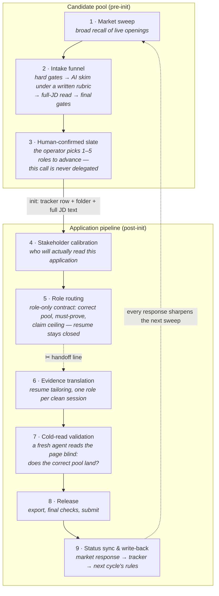

# The pipeline — one application's life

> **Public edition.** A generalized redraw of the production lifecycle spec. Stage names are translated, runtime details are abstracted to "the tracker" (a Postgres database that owns runtime truth). The structure — two worlds, one handoff line, milestones as fields — is the production design.

## Two worlds, one boundary

The system's first governance decision is a split: opportunities that haven't earned deep work live in the **candidate pool**; only opportunities worth applying to enter the **application pipeline**. The boundary is explicit — a row in the applications table — so "is this being worked on?" is never a matter of opinion.

*Each gate wears a different expert lens and asks a different question. (This visual shows the earlier seven-decision layout; the current system runs six — outreach and follow-up merged.)*

## The handoff line (stage 5 → 6)

The dotted cut is deliberate and is the pipeline's most opinionated design choice. Stages 1–5 are **role-only calibration**: they read the market, the org, and the job — never the resume — so they can run batched, in one orchestration session, consistently across many roles. Stage 6 onward is **quality-decisive work**: each role gets its own clean session, because tailoring two roles in one context lets framing bleed between them and dilutes the later one.

Know what may run in parallel; know what must be isolated.

## Milestones are fields, not memories

Every node writes its completion into a canonical tracker field in the same turn the artifact lands — routing done, tailor done, exported, submitted, response received. The definition of done is uniform across the whole pipeline:

> done = artifact landed **+** canonical state written back **+** downstream can continue.

A skipped write-back counts as not done, and state drift is prevented by design rather than by remembering. This is what makes the system auditable months later: the tracker is a queryable history of every judgment, not a to-do app.

## The gate principle

Gates are not free — each one taxes every run. A node earns a gate only when it is frequently missing, easy to get wrong, or when poor quality directly damages the next step. Most gates just check facts (does the artifact exist, is the milestone written); only a few nodes carry true quality gates, and those consume the artifact's own self-checks rather than re-reviewing everything from scratch.

The goal is fewer wasted runs and less state drift — not a pipeline where every step re-audits the last.
