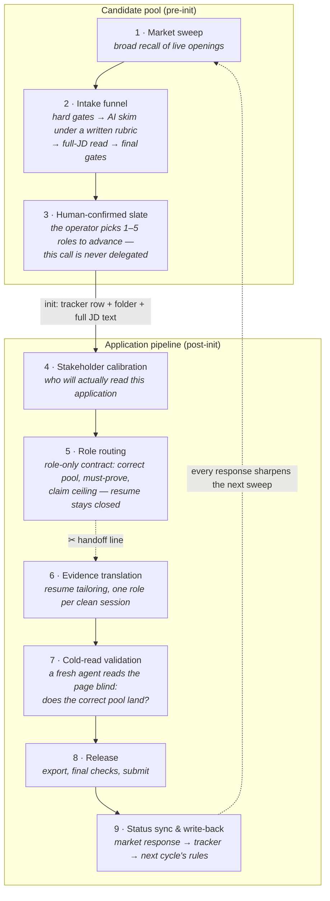

# The pipeline — one application's life

> **Public edition.** A generalized redraw of the production lifecycle spec. Stage names are translated, runtime details are abstracted to "the tracker" (a Postgres database that owns runtime truth). The structure — two worlds, one handoff line, milestones as fields — is the production design.

## Two worlds, one boundary

The system's first governance decision is a split: opportunities that haven't earned deep work live in the **candidate pool**; only opportunities worth applying to enter the **application pipeline**. The boundary is explicit — a row in the applications table — so "is this being worked on?" is never a matter of opinion.

*Each gate wears a different expert lens and asks a different question. (This visual shows the earlier seven-decision layout; the current system runs six — outreach and follow-up merged.)*

## The pipeline, staffed

Nine nodes, run by one person — because each node's judgment is written down as a named, versioned module. Skills own a judgment; commands are thin entry points that route into them (the separation shown in [exhibit 2b](../skills/systemize-learnings/retrospective.command.md)). These are real module names from the production system as of 2026-07-11, each tied to the one judgment it owns:

| Stage | Module | The judgment it owns |
|---|---|---|
| 1 · Market sweep | sweep presets *(skills — internal codenames, kept off-stage)* | which corners of the live market to recall, lane by lane |
| 1 · Market sweep | `scan-company-board` *(command)* | narrow screen of one company's official job board |
| 1 · Market sweep | `verify-jd` *(command)* | is this posting real, live, and the canonical URL? |
| 1 · Market sweep | `manual-jd-intake` *(command)* | hand-carried JD text enters through the same governed write-back as everything else |
| 2 · Intake funnel | `run-intake` *(command)* | batch recall → hard gates → AI skim under a written rubric → full-JD read → final gates |
| 2 · Intake funnel | `jd-analyze` *(command)* | the full structured read of one JD before any downstream work runs |
| 3 · Slate | `next-init` *(command)* | shortlist ranking plus a recommendation the human can veto in one word |
| 3 · Slate | `init-app` *(command)* | the admission gate: tracker row + folder + full JD text, or the application doesn't exist |
| 3 · Slate | `ready-to-apply` *(skill)* | queue view — what is actually ready, what is blocked, and why |
| 4 · Stakeholder calibration | `linkedin-people` *(skill)* | who will actually read this application — likely hiring manager, routing owner, peer truth sources |
| 4 · Stakeholder calibration | `linkedin-people-worker` *(command)* | the central calibration queue feeding stage 5 |
| 4 · Stakeholder calibration | `linkedin-read` *(skill)* | authenticated page reads that must report what they could *not* see before anyone reasons from them |
| 4–7 · Mainline | `init-network` *(command)* | the front-stage mainline that walks one role from init to resume-ready |
| 5 · Role routing | [`jd-loop-routing`](../skills/jd-loop-routing/SKILL.md) *(skill · exhibit 1)* | correct pool, must-prove, claim ceiling — written before the resume is ever opened |
| 6 · Evidence translation | [`resume-tailor`](../skills/resume-tailor/EXCERPT.md) *(skill · exhibit 3a)* | translating real evidence into this reader's language without borrowing what can't be defended |
| 6 · Evidence translation | `resume-ssot` *(skill)* | single entry point to the source-of-truth resumes — read, audit, or promote wording back through one door |
| 6 · Evidence translation | `resume-fit-page` *(skill)* | one-page PDF geometry: propose a single trim, then wait for go |
| 6 · Evidence translation | `resume-export` *(skill)* | template sync, PDF export, page-count validation |
| 6 · Evidence translation | `cl-adapt` / `cl-export` *(skills — off the default path)* | cover letters activate only when a platform requires one or the operator asks; by ruling, they gate nothing |
| 7 · Cold-read validation | [`graders`](../skills/resume-tailor/graders.md) *(exhibit 3b)* | a 7-check exit gate that points, never re-edits |
| 7 · Cold-read validation | `resume-cross-audit` *(command)* | generates an audit prompt for a second, unaffiliated model — a reader with no stake in the draft |
| 7 · Cold-read validation | `resume-finalize` *(command)* | the finalize entry: nothing ships from a draft state |
| 8 · Release | `apply-mode` *(skill)* | browser-assisted form work that always stops before Submit — the click is human |
| 8 · Release | `apply-check` *(skill)* | final form check against one fixed personal-data source of truth |
| 9 · Status & write-back | `update-status` *(command)* | one entry point for state changes — no hand-edited fields |
| 9 · Status & write-back | `email-status-sync` *(skill)* | inbox → classified signals → dry-run → confirmed write-back; read-only on the mailbox itself ([seen running](../examples/annotated-session.md)) |
| 9 · Status & write-back | `linkedin-networking-sync` *(skill)* | sent / pending / accepted / replied as a ledger, not a memory |
| 9 · Status & write-back | `linkedin-first-connect` / `linkedin-connect` *(skills)* | outreach segmented by reader — recruiter, hiring manager, peer — drafted for review, never auto-sent |
| 9 · Status & write-back | [`systemize-learnings`](../skills/systemize-learnings/SKILL.md) *(skill · exhibit 2a)* | which lessons earn their way into long-term rules — the default answer is *don't* |
| 9 · Status & write-back | [`retrospective`](../skills/systemize-learnings/retrospective.command.md) *(command · exhibit 2b)* | the closing entry point that routes into it |
| 9 · Status & write-back | `phrase-capture` *(skill)* | language that outperformed gets captured the day it appears, before it evaporates |
| Downstream | `interview-script` *(skill)* | the same positioning, extended into an interview narrative that survives follow-up questions |
| Public surfaces | `pipeline-page` / `linkedin-profile-refresh` / `candidate-materials-edit` *(skills)* | the public surfaces are governed like the pipeline: one source of truth each, no drift between them |

This roster names 22 of the 39 skills and 13 of the 26 commands live as of 2026-07-11 (exact dated counts: [evidence ledger](evidence-ledger.md)). What's missing is deliberate: sweep presets carry internal codenames, some modules are vendor- or course-specific utilities, and a few encode private research surfaces. Retirement is normal here — the most recent cut was `hiring-memo` (2026-07-10), absorbed into a sharper resume-pitch flow. More modules isn't better; owned judgments are.

## The handoff line (stage 5 → 6)

The dotted cut is deliberate and is the pipeline's most opinionated design choice. Stages 1–5 are **role-only calibration**: they read the market, the org, and the job — never the resume — so they can run batched, in one orchestration session, consistently across many roles. Stage 6 onward is **quality-decisive work**: each role gets its own clean session, because tailoring two roles in one context lets framing bleed between them and dilutes the later one.

Know what may run in parallel; know what must be isolated.

## Milestones are fields, not memories

Every node writes its completion into a canonical tracker field in the same turn the artifact lands — routing done, tailor done, exported, submitted, response received. The definition of done is uniform across the whole pipeline:

> done = artifact landed **+** canonical state written back **+** downstream can continue.

A skipped write-back counts as not done, and state drift is prevented by design rather than by remembering. This is what makes the system auditable months later: the tracker is a queryable history of every judgment, not a to-do app.

## The gate principle

Gates are not free — each one taxes every run. A node earns a gate only when it is frequently missing, easy to get wrong, or when poor quality directly damages the next step. Most gates just check facts (does the artifact exist, is the milestone written); only a few nodes carry true quality gates, and those consume the artifact's own self-checks rather than re-reviewing everything from scratch.

The goal is fewer wasted runs and less state drift — not a pipeline where every step re-audits the last.
