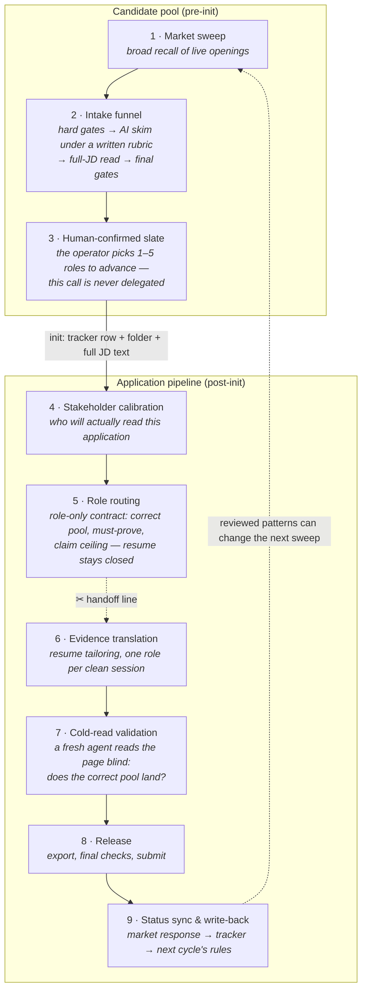
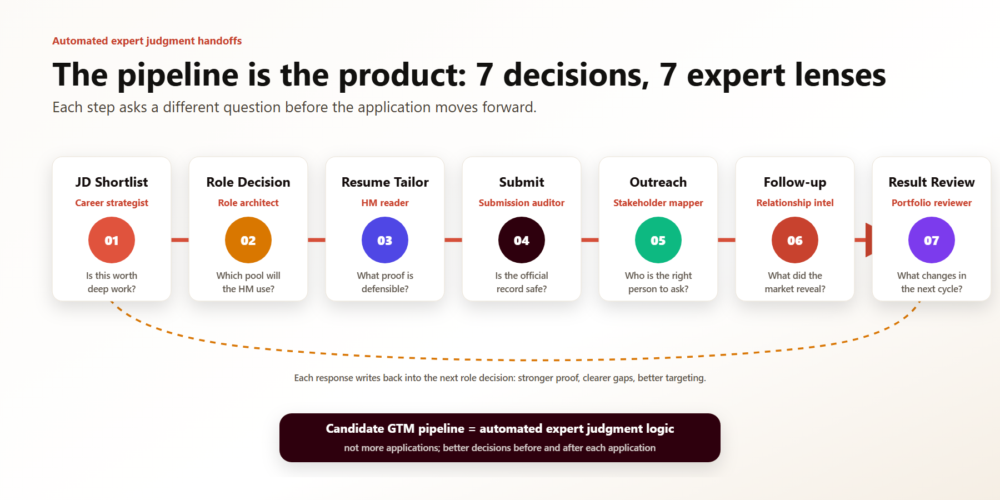

# The Candidate GTM pipeline — one market opportunity's life

> **Public edition.** A generalized redraw of the production lifecycle spec. Stage names are translated, runtime details are abstracted to "the tracker" (a Postgres database that owns runtime truth). The job search is the live case; the transferable read is a go-to-market motion that turns noisy demand signals into qualified attention, buyer-specific positioning, governed release, and next-cycle learning.

## Two worlds, one boundary

The system's first market decision is a split: opportunities that have not earned deep work stay in the **candidate pool**; only opportunities worth a deliberate release enter the **application pipeline**. Attention is the scarce budget. The boundary is explicit — a row in the applications table — so qualification changes investment, not just a label.

*Each gate wears a different expert lens and asks a different question. (This visual shows the earlier seven-decision layout; the current system runs six — outreach and follow-up merged.)*

## The same pipeline, in Marketing / GTM language

This is an interpretation layer over the real runtime sequence, not a claim that a personal job search owns an enterprise revenue funnel.

| Runtime stage | Marketing / GTM read | The decision it improves | Claim boundary |
|---|---|---|---|
| Market sweep | Market sensing / opportunity discovery | Which parts of live demand deserve attention | Raw volume is not qualified demand or buyer intent |
| Intake + slate | Qualification / segmentation / prioritization | Which opportunities receive a full human investment | Not lead scoring or campaign targeting ownership |
| Stakeholder calibration | Audience and decision-role intelligence | Whose context should shape the role read and next touch | A person is a contact, not automatically a persona |
| Role routing | Targeting + correct-pool diagnosis | Which market category and buyer problem positioning must land inside | Not candidate evidence and not final message copy |
| Evidence translation | Positioning + value proposition + proof development | Why this reader should take the next step | Translates true evidence; never borrows role ownership |
| Cold read + release | Conversion QA / message-risk control | Whether the right reader sees relevant, defensible value before launch | No conversion uplift without a comparable denominator |
| Status + outreach state | CRM state / lifecycle follow-through | Which next action is due and what context downstream can trust | Personal CRM discipline, not enterprise administration |
| Response + write-back | Loss learning / closed-loop optimization | What targeting, proof, message, or rule should change next | Loss hypotheses are not formal attribution |

The worked capability and evidence mapping is public in [the Marketing-reframe run](../examples/marketing-reframe-run.md).

## The six gates

The nine nodes above are where work happens; the six gates are where a human decides. The counts differ on purpose: a node is a stage of the pipeline, a gate is a judgment call that refuses to be delegated. The operating picture groups work into broader buyer-facing lenses; this table names lifecycle decisions. They connect by function, not by shared labels.

| # | Gate | The human call | Where it sits |
|---|---|---|---|
| 1 | **Find the right role** | which corners of the live market deserve attention this cycle — the sweep rubric and every exception to it | stages 1–2 |
| 2 | **Decide the fit** | does this opportunity earn a full release — the slate pick is never delegated, and admission is what creates the tracker row | stage 3 |
| 3 | **Tailor the resume** | does the translated page speak this reader's language without borrowing scope — approved against a claim ceiling written back when the resume was still closed | stages 6–7, fed by the resume-closed calibration of stages 4–5 |
| 4 | **Submit** | the release click itself — browser-assisted form work always stops before Submit | stage 8 |
| 5 | **Outreach & follow up** | every message is drafted for review and sent by a human, then logged as a ledger instead of a memory | stage 9 — the diagram shows the state it writes; the outreach modules themselves are staffed in the roster below |
| 6 | **Review the result** | what the response actually teaches — the state ruling (rejected is not role-closed) and which lessons earn a rule change | stage 9 |

In Marketing terms: qualification, segment investment, positioning sign-off, launch, touchpoint execution, and loss learning. AI prepares every one of these decisions and executes the pre-authorized write-backs they produce; the decisions themselves stay human.

## The pipeline, staffed

Nine nodes, run by one person — because each node's judgment is written down as a named, versioned module. The operating board shows the functional lenses; this roster opens the modules that staff those functions. Skills own a judgment; commands are thin entry points that route into them (the separation shown in [exhibit 2b](../skills/systemize-learnings/retrospective.command.md)). These are real module names from the production system as of 2026-07-24, each tied to the one decision it improves:

| Stage | Module | The judgment it owns |
|---|---|---|
| 1 · Market sweep | sweep presets *(skills — internal codenames, kept off-stage)* | which corners of the live market to recall, lane by lane |
| 1 · Market sweep | `scan-company-board` *(command)* | narrow screen of one company's official job board |
| 1 · Market sweep | `verify-jd` *(command)* | is this posting real, live, and the canonical URL? |
| 1 · Market sweep | `manual-jd-intake` *(command)* | hand-carried JD text enters through the same governed write-back as everything else |
| 2 · Intake funnel | `run-intake` *(command)* | batch recall → hard gates → AI skim under a written rubric → full-JD read → final gates |
| 2 · Intake funnel | `jd-analyze` *(command)* | the full structured read of one JD before any downstream work runs |
| 3 · Slate | `next-init` *(command)* | shortlist ranking plus a recommendation the human can veto in one word |
| 3 · Slate | `init-app` *(command)* | the admission gate: tracker row + folder + full JD text, or the application doesn't exist |
| 3 · Slate | `jd-progress` *(skill)* | the campaign board — readiness queues, post-apply tracking, and the single next action per role |
| 4 · Stakeholder calibration | `linkedin-people` *(skill)* | who will actually read this application — likely hiring manager, routing owner, peer truth sources |
| 4 · Stakeholder calibration | `linkedin-people-worker` *(command)* | the central calibration queue feeding stage 5 |
| 4 · Stakeholder calibration | `linkedin-read` *(skill)* | authenticated page reads that must report what they could *not* see before anyone reasons from them |
| 4–7 · Mainline | `init-network` *(command)* | the front-stage mainline that walks one role from init to resume-ready |
| 5 · Role routing | [`jd-loop-routing`](../skills/jd-loop-routing/SKILL.md) *(skill · exhibit 1)* | correct pool, must-prove, claim ceiling — written before the resume is ever opened |
| 6 · Evidence translation | [`resume-tailor`](../skills/resume-tailor/EXCERPT.md) *(skill · exhibit 3a)* | translating real evidence into this reader's language without borrowing what can't be defended |
| 6 · Evidence translation | `resume-ssot` *(skill)* | single entry point to the source-of-truth resumes — read, audit, or promote wording back through one door |
| 6 · Evidence translation | `resume-fit-page` *(skill)* | one-page PDF geometry: propose a single trim, then wait for go |
| 6 · Evidence translation | `resume-export` *(skill)* | template sync, PDF export, page-count validation |
| 6 · Evidence translation | `cl-adapt` / `cl-export` *(skills — off the default path)* | cover letters activate only when a platform requires one or the operator asks; by ruling, they gate nothing |
| 7 · Cold-read validation | [`graders`](../skills/resume-tailor/graders.md) *(exhibit 3b)* | a 7-check exit gate that points, never re-edits |
| 7 · Cold-read validation | `resume-cross-audit` *(command)* | generates an audit prompt for a second, unaffiliated model — a reader with no stake in the draft |
| 7 · Cold-read validation | `resume-finalize` *(command)* | the finalize entry: nothing ships from a draft state |
| 8 · Release | `apply-mode` *(skill)* | browser-assisted form work that always stops before Submit — the click is human |
| 8 · Release | `apply-check` *(skill)* | final form check against one fixed personal-data source of truth |
| 9 · Status & write-back | `update-status` *(command)* | one entry point for state changes — no hand-edited fields |
| 9 · Status & write-back | `email-status-sync` *(skill)* | inbox → classified signals → dry-run → confirmed write-back; read-only on the mailbox itself ([seen running](../examples/annotated-session.md)) |
| 9 · Status & write-back | `linkedin-networking-sync` *(skill)* | sent / pending / accepted / replied as a ledger, not a memory ([seen running](../examples/one-brief-controlled-run.md)) |
| 9 · Status & write-back | `linkedin-first-connect` / `linkedin-connect` *(skills)* | outreach segmented by reader — recruiter, hiring manager, peer — drafted for review, never auto-sent |
| 9 · Status & write-back | [`systemize-learnings`](../skills/systemize-learnings/SKILL.md) *(skill · exhibit 2a)* | which lessons earn their way into long-term rules — the default answer is *don't* |
| 9 · Status & write-back | [`retrospective`](../skills/systemize-learnings/retrospective.command.md) *(command · exhibit 2b)* | the closing entry point that routes into it |
| 9 · Status & write-back | `phrase-capture` *(skill)* | language that outperformed gets captured the day it appears, before it evaporates |
| Downstream | `interview-script` *(skill)* | the same positioning, extended into an interview narrative that survives follow-up questions |
| Conditional calibration | [`marketing-reframe`](../skills/marketing-reframe/SKILL.md) *(skill · exhibit 4)* | which Marketing / GTM capability a true mechanism can defend, at which evidence level, for which buyer decision |
| Public surfaces | `pipeline-page` / `linkedin-profile-refresh` / `candidate-materials-edit` *(skills)* | the public surfaces are governed like the pipeline: one source of truth each, no drift between them |

This roster names 23 of the 44 skills and 13 of the 26 commands live as of 2026-07-22 (exact dated counts: [evidence ledger](evidence-ledger.md)). What's missing is deliberate: sweep presets carry internal codenames, some modules are vendor- or course-specific utilities, and a few encode private research surfaces. Retirement is normal here — the most recent cut was `hiring-memo` (2026-07-10), and the most recent rename widened `ready-to-apply` into `jd-progress` (2026-07-24), from a readiness queue into full campaign progress. More modules isn't better; owned judgments are.

## The handoff line (stage 5 → 6)

The dotted cut is deliberate and is the pipeline's most opinionated positioning decision. Stages 1–5 are **market and audience calibration**: they read demand, the org, the decision roles, and the work — never the resume — so the target is set before message development can bias it. Stage 6 onward is **quality-decisive positioning and release work**: each role gets its own clean session, because two markets in one context let audience, value proposition, and proof bleed between them.

Know what may run in parallel; know what must be isolated.

## Milestones are fields, not memories

Production milestones write their owned tracker fields in the same turn the artifact lands — people calibration, routing, tailoring, export, submission, and outcome state. Research notes and intermediate judgments remain linked artifacts; the tracker is not a per-judgment event log. This is the system's lifecycle and data-trust layer: downstream work reads canonical milestone state instead of inventing its own. The definition of done is uniform across the whole pipeline:

> done = artifact landed **+** canonical state written back **+** downstream can continue.

A skipped required write-back counts as not done. That makes drift visible and bounded rather than impossible: months later, the canonical milestone and lifecycle state can be queried and checked against its linked artifact. The tracker is an operating record, not a memory substitute or a claim to event-source every judgment.

## The gate principle

Gates are not free — each one taxes every run. A node earns a gate only when it is frequently missing, easy to get wrong, or when poor quality directly creates conversion leakage or corrupts the next readout. Most gates just check facts (does the artifact exist, is the lifecycle state written); only a few nodes carry true quality gates, and those consume the artifact's own self-checks rather than re-reviewing everything from scratch.

The goal is fewer wasted runs and less state drift — not a pipeline where every step re-audits the last.
