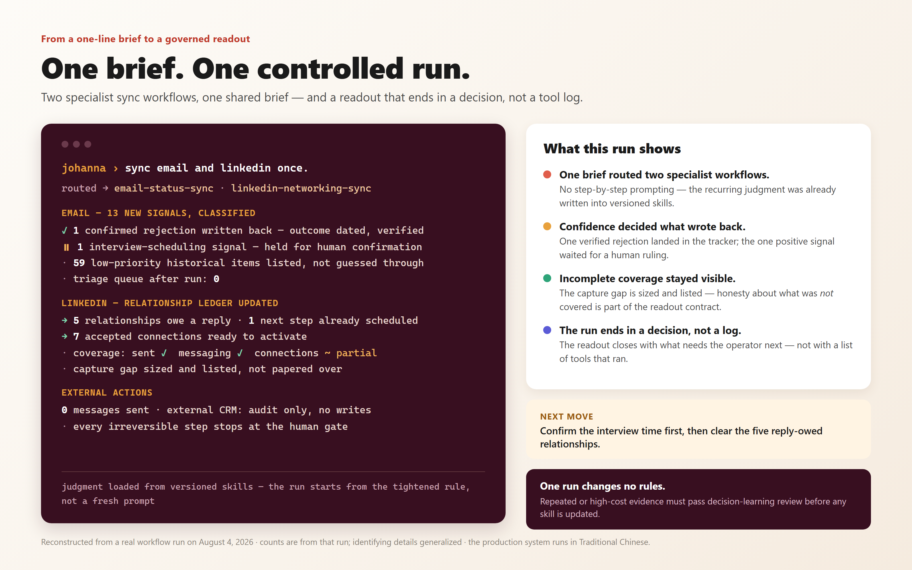

# One brief, one controlled run — the orchestration surface

> **Checkable artifact.** Re-authored from a real dual-sync run on August 4, 2026. The counts are from that run; companies, people, and internal paths are generalized by construction. The two modules shown — `email-status-sync` and `linkedin-networking-sync` — are both stage 9 of [the Candidate GTM pipeline](../docs/pipeline.md#the-pipeline-staffed). [The annotated session](annotated-session.md) goes deep inside one of them, beat by beat; this exhibit stays one level up and shows what the operator actually sees: one brief, two specialist workflows, and a readout built to end in a decision.

---

## Reading the receipt

**The brief costs one line because the judgment was paid for earlier.** "Sync email and linkedin once" carries no instructions about tiers, gates, or write rules — all of that is versioned in the two skills and loads on invocation. This is the Reuse step of [the loop](../docs/the-loop.md) at orchestration scale: the operator is not re-negotiating method per session, and the method cannot silently drift per session either.

**Confidence decided the one write that happened.** Thirteen email signals came in; exactly one crossed the write-back bar — a confirmed rejection with strong closing language and a unique tracker match, written with a dated outcome and read back for verification. The one *positive* signal (an interview-scheduling message) was held for human confirmation, even though it is the best news in the batch. The asymmetry is deliberate: a rejection write-back closes a record; an interview commitment creates obligations toward a real person, and that class of state never lands on a classifier's confidence alone.

**Incomplete coverage is reported, not smoothed over.** The LinkedIn side finished its sent and messaging surfaces but hit a collection limit on connections — so the readout says `partial` and sizes the capture gap instead of presenting a complete-looking picture. That rule has a history: a failed collection query once read as a cold market, which is why readouts now carry collection health as first-class content ([failure log](failure-guardrail-log.md)). A gap you can see is a queue item; a gap you can't see is a wrong conclusion.

**Zero external actions is the point, not a limitation.** Fifty-nine historical items were listed rather than guessed through, the external CRM got an audit rather than a write, and no message left the system. Anything irreversible — an outbound message, a public state change — stops at the human gate by contract, not by mood. The run's job was to make the operator's next judgment cheap, not to act on her behalf.

**The readout ends in a decision.** Not "12 tools ran successfully," but a ranked next move: confirm the interview time first, then clear the five reply-owed relationships. The ordering is itself judgment — a scheduling commitment to another person outranks a follow-up queue — and it is the hand-off point where the machine stops and the operator starts.

## What one run may not do

One run changes no rules. The session produced evidence — a held signal, a sized coverage gap, a clean triage — but none of it rewrites a skill on the spot. Only repeated or high-cost evidence passes [the write-back triage](../skills/systemize-learnings/SKILL.md) before a contract is updated. A system that adds a rule after every session isn't learning; it's sedimenting.

## Why this artifact is here

Most public claims about "AI agents" show either a chat transcript or a demo reel. This receipt shows the layer a hiring manager should actually care about: whether a one-line brief can route real specialist work, whether the confidence rules hold under a mixed batch, whether the system tells the truth about what it did not cover, and whether the human stays where the irreversible decisions are. The same shape — brief in, governed readout out, exceptions surfaced, learning gated — is what [running this as a team](../docs/from-one-operator-to-a-team.md) would make structural.
